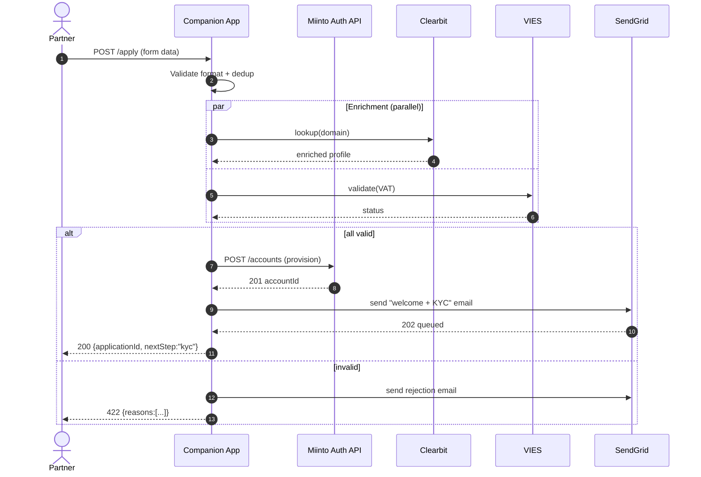
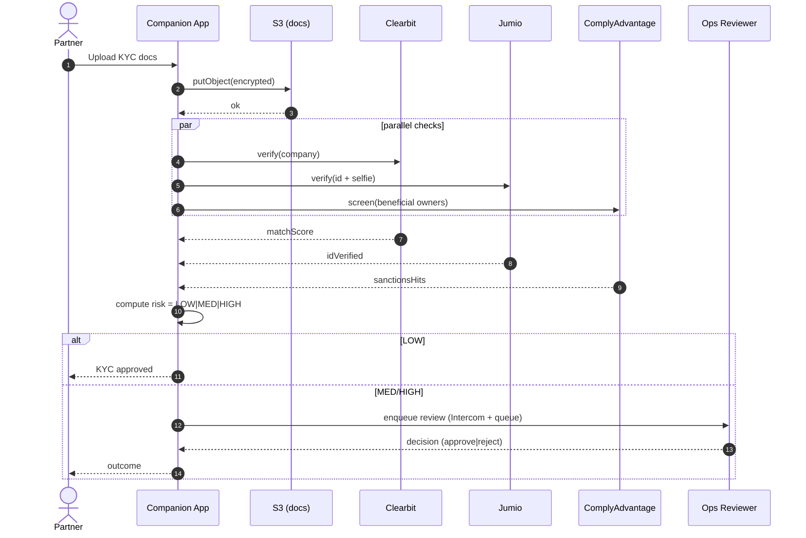
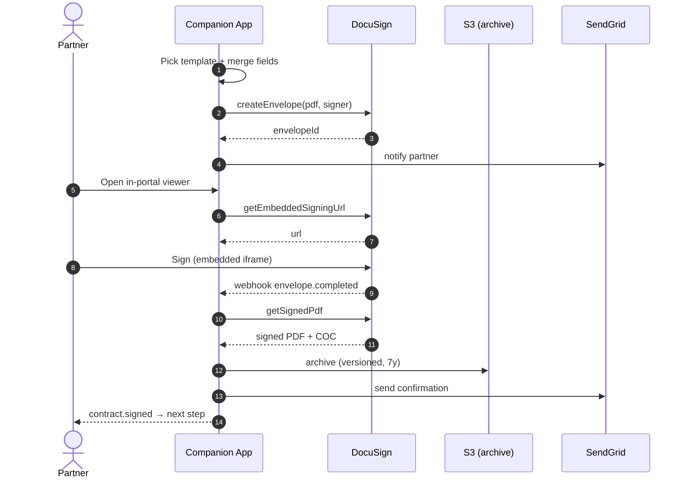
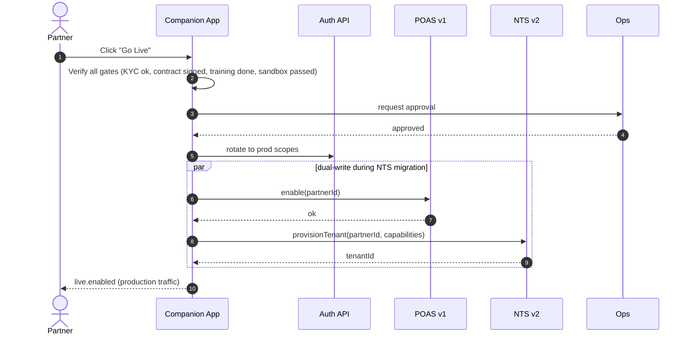
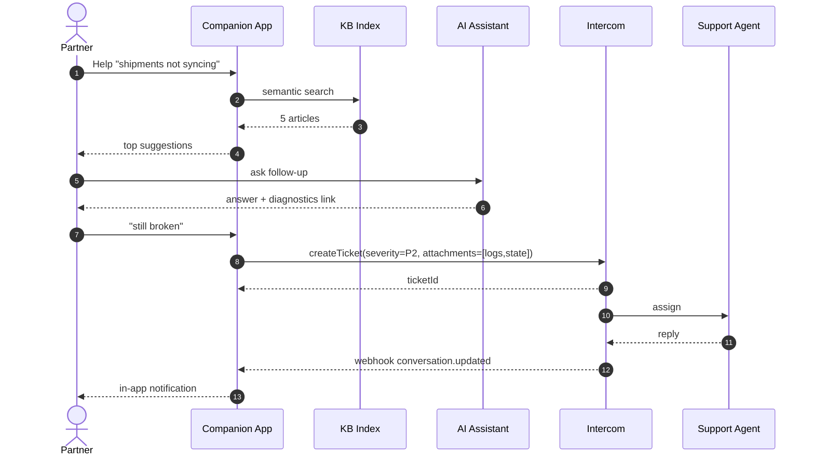
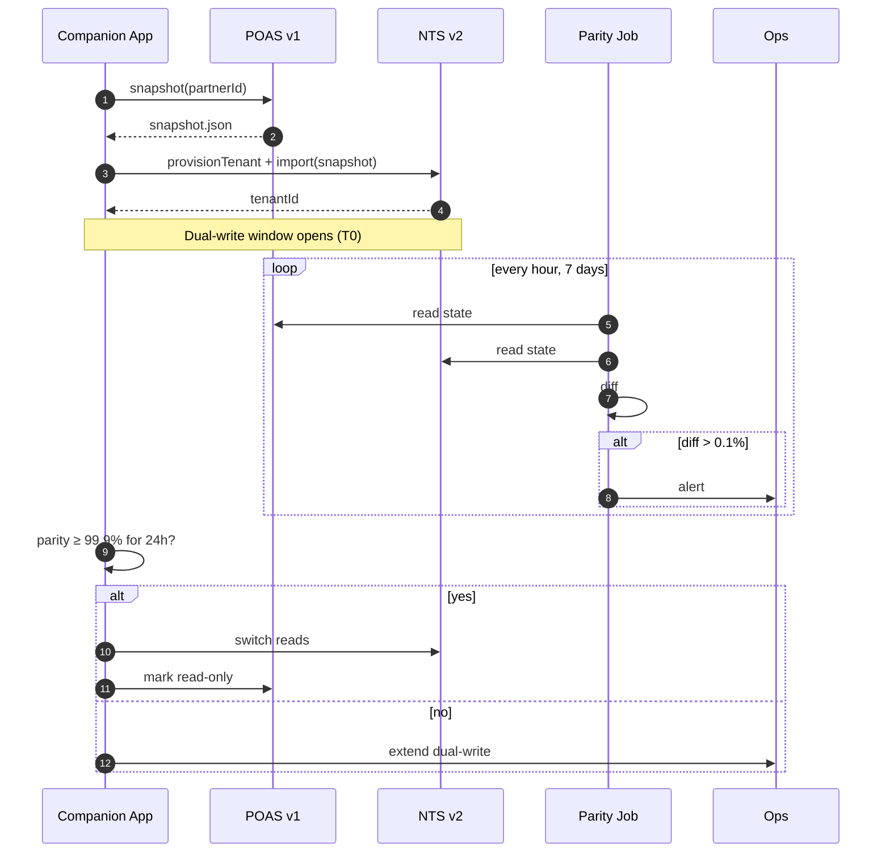

# Business Process Models — Partner Onboarding

> **Architectural note**: All partner-facing processes are orchestrated by the **Companion App**. The Companion App is the single front-of-house orchestrator that drives the partner through every phase, calls Miinto's internal APIs (Auth, POAS, NTS) and external services (DocuSign, Clearbit, Jumio, SendGrid, Intercom), and is responsible for state, retries, and SLA tracking.

---

## Table of Contents

1. [End-to-End BPMN (Companion App as Orchestrator)](#1-end-to-end-bpmn-companion-app-as-orchestrator)
2. [Sub-Process: Contract Signing](#2-sub-process-contract-signing)
3. [Sub-Process: KYC Verification](#3-sub-process-kyc-verification-automated--manual)
4. [Sub-Process: Training Module](#4-sub-process-training-module-video--quiz--certification)
5. [Sub-Process: Self-Service Support](#5-sub-process-self-service-support-kb--ticket--resolution)
6. [Sequence Diagrams](#6-sequence-diagrams)
7. [NTS Migration Process](#7-nts-migration-process-mandatory-by-2025-12-31)
8. [Error States & Retry Logic](#8-error-states--retry-logic)
9. [SLA Metrics (per Step)](#9-sla-metrics-per-step)
10. [Failure Handling & Rollback](#10-failure-handling--rollback)

---

## 1. End-to-End BPMN (Companion App as Orchestrator)

```bpmn
<?xml version="1.0" encoding="UTF-8"?>
<bpmn:definitions xmlns:bpmn="http://www.omg.org/spec/BPMN/20100524/MODEL"
                  id="Definitions_OnboardingV2" exportName="Partner Onboarding (Companion-orchestrated)">

  <bpmn:collaboration id="Collab_1">
    <bpmn:participant id="Pool_Partner"      name="Partner"            processRef="Proc_Partner"/>
    <bpmn:participant id="Pool_Companion"    name="Companion App"      processRef="Proc_Companion"/>
    <bpmn:participant id="Pool_Miinto"       name="Miinto Core (Auth, POAS, NTS)" processRef="Proc_Miinto"/>
    <bpmn:participant id="Pool_External"     name="External Services"  processRef="Proc_External"/>
    <bpmn:participant id="Pool_Ops"          name="Miinto Ops / Compliance" processRef="Proc_Ops"/>
  </bpmn:collaboration>

  <!-- ====================== PARTNER LANE ====================== -->
  <bpmn:process id="Proc_Partner">
    <bpmn:startEvent id="P_Start" name="Discovers Miinto"/>
    <bpmn:task       id="P_Apply" name="Submits Application"/>
    <bpmn:task       id="P_KYC"   name="Uploads KYC Documents"/>
    <bpmn:task       id="P_Sign"  name="Reviews &amp; Signs Contract"/>
    <bpmn:task       id="P_Train" name="Completes Training &amp; Quiz"/>
    <bpmn:task       id="P_Test"  name="Runs Sandbox Tests"/>
    <bpmn:endEvent   id="P_Live"  name="Goes Live"/>
  </bpmn:process>

  <!-- ====================== COMPANION APP (ORCHESTRATOR) ====================== -->
  <bpmn:process id="Proc_Companion">
    <bpmn:startEvent id="C_Start"/>

    <!-- Phase 1: Application -->
    <bpmn:task id="C_ValidateApp" name="Validate Application
(VAT, format, dedup)"/>
    <bpmn:exclusiveGateway id="C_Gw_AppValid" name="Valid?"/>
    <bpmn:task id="C_EnrichClearbit" name="Enrich via Clearbit"/>
    <bpmn:task id="C_RejectApp" name="Reject + Notify"/>

    <!-- Phase 2: Account Provisioning -->
    <bpmn:task id="C_CreateAuth" name="Create Auth Account
(Miinto Auth API)"/>
    <bpmn:task id="C_StartKyc"   name="Trigger KYC Sub-process"/>
    <bpmn:callActivity id="C_Call_KYC" name="KYC Verification" calledElement="Subproc_KYC"/>

    <!-- Phase 3: Contract -->
    <bpmn:callActivity id="C_Call_Contract" name="Contract Signing" calledElement="Subproc_Contract"/>

    <!-- Phase 4: Technical setup -->
    <bpmn:task id="C_GenCreds" name="Generate API Credentials
(Auth + POAS scopes)"/>
    <bpmn:task id="C_ProvisionNts" name="Provision NTS Tenant
(if applicable)"/>
    <bpmn:task id="C_ConfigWebhooks" name="Configure Webhooks"/>

    <!-- Phase 5: Training -->
    <bpmn:callActivity id="C_Call_Training" name="Training &amp; Certification" calledElement="Subproc_Training"/>

    <!-- Phase 6: Sandbox & Go-Live -->
    <bpmn:task id="C_SandboxTests" name="Run Sandbox Test Suite"/>
    <bpmn:exclusiveGateway id="C_Gw_Ready" name="All checks pass?"/>
    <bpmn:task id="C_GoLive" name="Enable Production
(POAS + NTS)"/>
    <bpmn:task id="C_PostLive" name="Post-Live Monitoring (T+7d)"/>

    <bpmn:endEvent id="C_End" name="Partner Live"/>
    <bpmn:endEvent id="C_EndRej" name="Application Rejected"/>
  </bpmn:process>

  <!-- ====================== KYC SUB-PROCESS ====================== -->
  <bpmn:process id="Subproc_KYC" isExecutable="true">
    <bpmn:startEvent id="K_Start"/>
    <bpmn:task id="K_Collect"     name="Collect Documents (S3)"/>
    <bpmn:task id="K_Vies"        name="VIES VAT Lookup"/>
    <bpmn:task id="K_Clearbit"    name="Clearbit Verification"/>
    <bpmn:task id="K_Jumio"       name="Owner ID Verification (Jumio)"/>
    <bpmn:task id="K_Sanctions"   name="Sanctions / PEP Screen"/>
    <bpmn:exclusiveGateway id="K_Gw_Risk" name="Risk Score?"/>
    <bpmn:task id="K_AutoApprove" name="Auto-Approve (LOW)"/>
    <bpmn:userTask id="K_Manual"  name="Manual Compliance Review (MED/HIGH)"/>
    <bpmn:endEvent id="K_End"/>
  </bpmn:process>

  <!-- ====================== CONTRACT SUB-PROCESS ====================== -->
  <bpmn:process id="Subproc_Contract" isExecutable="true">
    <bpmn:startEvent id="Co_Start"/>
    <bpmn:task id="Co_Tier"       name="Determine Commission Tier"/>
    <bpmn:task id="Co_Generate"   name="Generate PDF (template + merge fields)"/>
    <bpmn:task id="Co_Envelope"   name="Create DocuSign Envelope"/>
    <bpmn:task id="Co_NotifyPartner" name="Email + In-App Prompt"/>
    <bpmn:userTask id="Co_PartnerSign" name="Partner Reviews &amp; Signs"/>
    <bpmn:task id="Co_Countersign" name="Miinto Counter-Signature"/>
    <bpmn:task id="Co_Archive"    name="Archive Signed PDF (S3, 7y)"/>
    <bpmn:endEvent id="Co_End"/>
  </bpmn:process>

  <!-- ====================== TRAINING SUB-PROCESS ====================== -->
  <bpmn:process id="Subproc_Training" isExecutable="true">
    <bpmn:startEvent id="T_Start"/>
    <bpmn:task id="T_Video"  name="Watch Video Module"/>
    <bpmn:task id="T_Quiz"   name="Take Module Quiz"/>
    <bpmn:exclusiveGateway id="T_Gw_Pass" name="Pass (≥80%)?"/>
    <bpmn:task id="T_Retry"  name="Retry (max 3 attempts)"/>
    <bpmn:task id="T_Cert"   name="Issue Certificate"/>
    <bpmn:endEvent id="T_End"/>
  </bpmn:process>

  <!-- ====================== MIINTO CORE LANE ====================== -->
  <bpmn:process id="Proc_Miinto">
    <bpmn:task id="M_Auth"  name="Auth API: account + scopes"/>
    <bpmn:task id="M_POAS"  name="POAS v1: legacy partner record"/>
    <bpmn:task id="M_NTS"   name="NTS v2: tenant + capabilities"/>
  </bpmn:process>

  <!-- ====================== EXTERNAL SERVICES LANE ====================== -->
  <bpmn:process id="Proc_External">
    <bpmn:task id="E_Clearbit" name="Clearbit Enrichment"/>
    <bpmn:task id="E_VIES"     name="VIES VAT"/>
    <bpmn:task id="E_Jumio"    name="Jumio ID Verification"/>
    <bpmn:task id="E_DocuSign" name="DocuSign Envelope"/>
    <bpmn:task id="E_SendGrid" name="SendGrid Email"/>
    <bpmn:task id="E_Intercom" name="Intercom (Support)"/>
  </bpmn:process>

  <!-- ====================== OPS LANE ====================== -->
  <bpmn:process id="Proc_Ops">
    <bpmn:userTask id="O_KycReview"     name="KYC Manual Review"/>
    <bpmn:userTask id="O_GoLiveApprove" name="Go-Live Approval"/>
    <bpmn:userTask id="O_TicketTriage"  name="Support Ticket Triage"/>
  </bpmn:process>

</bpmn:definitions>
```

### Visual orchestration map (Companion App at the centre)

```
                ┌──────────────────────────────────────────────────┐
                │                  PARTNER (Browser)               │
                └──────────────────────────────────────────────────┘
                                       ▲   │
                                       │   ▼
                ┌──────────────────────────────────────────────────┐
                │              COMPANION APP (Orchestrator)        │
                │  ─ owns state machine, retries, SLAs, audit ─    │
                │   [Apply] → [KYC] → [Contract] → [Tech] →        │
                │   [Training] → [Sandbox] → [Go-Live]             │
                └──────────────────────────────────────────────────┘
              ▲          ▲          ▲          ▲          ▲
              │          │          │          │          │
   ┌──────────┘  ┌───────┘  ┌───────┘  ┌───────┘  ┌───────┘
   ▼             ▼          ▼          ▼          ▼
┌───────┐  ┌──────────┐  ┌─────────┐  ┌─────────┐  ┌──────────┐
│ Auth  │  │  POAS v1 │  │ NTS v2  │  │ DocuSign│  │ Clearbit │
│  API  │  │ (legacy) │  │  (new)  │  │  Jumio  │  │ SendGrid │
└───────┘  └──────────┘  └─────────┘  └─────────┘  └──────────┘
   Miinto Core APIs                External Services
```

---

## 2. Sub-Process: Contract Signing

```
┌─────────────────────────────────────────────────────────────────┐
│  CONTRACT SIGNING — orchestrated by Companion App                │
├─────────────────────────────────────────────────────────────────┤
│                                                                  │
│   [START]                                                        │
│      │                                                           │
│      ▼                                                           │
│   ┌────────────────────────────────────────────────┐             │
│   │ 2.1 Determine Commission Tier                  │             │
│   │   - reads enriched volume signals              │             │
│   │   - picks Standard / Premium / Wholesale       │             │
│   │   SLA target: <1s    max: 5s                   │             │
│   └────────────────────────────────────────────────┘             │
│      │                                                           │
│      ▼                                                           │
│   ┌────────────────────────────────────────────────┐             │
│   │ 2.2 Generate PDF (template + merge fields)     │             │
│   │   - merge: legal name, VAT, address, term      │             │
│   │   - store: S3 (versioned), hash recorded       │             │
│   │   SLA target: <5s    max: 60s                  │             │
│   └────────────────────────────────────────────────┘             │
│      │                                                           │
│      ▼                                                           │
│   ┌────────────────────────────────────────────────┐             │
│   │ 2.3 Create DocuSign Envelope                   │             │
│   │   - signer: primary contact                    │             │
│   │   - co-signer: required if >€5M revenue        │             │
│   │   - auth: email code + (optional) access code  │             │
│   │   SLA target: <10s   max: 60s                  │             │
│   └────────────────────────────────────────────────┘             │
│      │                                                           │
│      ▼                                                           │
│   ┌────────────────────────────────────────────────┐             │
│   │ 2.4 Notify Partner                             │             │
│   │   - SendGrid email + in-app banner             │             │
│   │   - reminders: D+3, D+7, D+10                  │             │
│   │   SLA target: <30s   max: 5min                 │             │
│   └────────────────────────────────────────────────┘             │
│      │                                                           │
│      ▼                                                           │
│   ┌────────────────────────────────────────────────┐             │
│   │ 2.5 Partner Signs (DocuSign embedded)          │             │
│   │   * USER TASK *                                │             │
│   │   - 4 mandatory checkboxes (T&C, commission,   │             │
│   │     data, authority)                           │             │
│   │   - signature drop, audit trail captured       │             │
│   │   SLA target: 3 days  max: 14 days             │             │
│   │   Timeout: void envelope, regenerate           │             │
│   └────────────────────────────────────────────────┘             │
│      │                                                           │
│      ▼                                                           │
│   ┌────────────────────────────────────────────────┐             │
│   │ 2.6 DocuSign Webhook → Companion App           │             │
│   │   event: envelope.completed                    │             │
│   │   verify: HMAC + envelopeId match              │             │
│   └────────────────────────────────────────────────┘             │
│      │                                                           │
│      ▼                                                           │
│   ┌────────────────────────────────────────────────┐             │
│   │ 2.7 Miinto Counter-Signature (automated)       │             │
│   │   - applied via service account                │             │
│   │   SLA target: <5min  max: 1h                   │             │
│   └────────────────────────────────────────────────┘             │
│      │                                                           │
│      ▼                                                           │
│   ┌────────────────────────────────────────────────┐             │
│   │ 2.8 Archive (S3 + DocuSign), 7-year retention  │             │
│   │   - hash recorded in audit log                 │             │
│   │   - confirmation email sent                    │             │
│   └────────────────────────────────────────────────┘             │
│      │                                                           │
│      ▼                                                           │
│   [END — contract.signed event published to bus]                 │
└─────────────────────────────────────────────────────────────────┘
```

**Key invariants**

| Property                  | Rule                                                |
|---------------------------|-----------------------------------------------------|
| Idempotency               | Envelope ID is the natural key; replays are no-ops  |
| Source of truth           | DocuSign (status), S3 (artifact), audit log (trail) |
| Retention                 | 7 years (regulatory)                                |
| Re-signing                | New envelope, old void; Companion holds version map |

---

## 3. Sub-Process: KYC Verification (Automated + Manual)

```
┌─────────────────────────────────────────────────────────────────┐
│  KYC VERIFICATION                                                │
├─────────────────────────────────────────────────────────────────┤
│   [START — partner upload trigger]                               │
│      │                                                           │
│      ▼                                                           │
│   ┌────────────────────────────────────────────┐                 │
│   │ 3.1 Document Intake                        │                 │
│   │   - Cert. of Incorporation                 │                 │
│   │   - VAT registration                       │                 │
│   │   - Proof of address (<3 months)           │                 │
│   │   - Owner ID + selfie                      │                 │
│   │   Stored in S3 (encrypted, partner-scoped) │                 │
│   │   SLA: <30s upload   max: 5min             │                 │
│   └────────────────────────────────────────────┘                 │
│      │                                                           │
│      ▼  (parallel fan-out)                                       │
│   ┌────────────────┬────────────────┬──────────────────┐         │
│   │ 3.2a VIES VAT  │ 3.2b Clearbit  │ 3.2c Jumio ID    │         │
│   │ SLA: <5s/30s   │ SLA: <10s/60s  │ SLA: <30s/2min   │         │
│   └────────┬───────┴────────┬───────┴─────────┬────────┘         │
│            └─── join ───────┴─────────────────┘                  │
│      │                                                           │
│      ▼                                                           │
│   ┌────────────────────────────────────────────┐                 │
│   │ 3.3 Sanctions / PEP / Adverse Media        │                 │
│   │   - OFAC, EU consolidated list             │                 │
│   │   - Provider: ComplyAdvantage              │                 │
│   │   SLA: <10s   max: 60s                     │                 │
│   └────────────────────────────────────────────┘                 │
│      │                                                           │
│      ▼                                                           │
│   ┌────────────────────────────────────────────┐                 │
│   │ 3.4 Risk Scoring (rules engine)            │                 │
│   │   inputs: VIES, Clearbit, Jumio, sanctions │                 │
│   │   output: LOW / MEDIUM / HIGH              │                 │
│   └────────────────────────────────────────────┘                 │
│      │                                                           │
│      ├── LOW  ───────────► AUTO-APPROVE → [END:approved]         │
│      │                                                           │
│      ├── MEDIUM ─────────► Manual review (Ops queue)             │
│      │                       SLA: 24h  max: 48h                  │
│      │                                                           │
│      └── HIGH ──────────► Compliance escalation                  │
│                              SLA: 48h  max: 5 business days      │
│                                                                  │
│      Outcomes: APPROVED / PENDING / REJECTED / BLOCKED           │
└─────────────────────────────────────────────────────────────────┘
```

**Decision matrix**

| Signal                                          | Auto outcome  |
|-------------------------------------------------|---------------|
| VIES valid + Clearbit match + Jumio pass + clean| APPROVED      |
| Any single soft-fail (e.g. doc unclear)         | PENDING       |
| VIES invalid                                    | REJECTED      |
| Sanctions / PEP hit                             | BLOCKED       |

---

## 4. Sub-Process: Training Module (Video → Quiz → Certification)

```
┌─────────────────────────────────────────────────────────────────┐
│  TRAINING — repeated for each module (5 in total)                │
├─────────────────────────────────────────────────────────────────┤
│   [START — partner enters /training]                             │
│      │                                                           │
│      ▼                                                           │
│   ┌─────────────────────────────────────┐                        │
│   │ 4.1 Watch Video                     │                        │
│   │   - progress tracked (heartbeat /5s)│                        │
│   │   - must reach ≥90% to advance      │                        │
│   │   SLA: video length × 1.0           │                        │
│   └─────────────────────────────────────┘                        │
│      │                                                           │
│      ▼                                                           │
│   ┌─────────────────────────────────────┐                        │
│   │ 4.2 Take Quiz (5–10 questions)      │                        │
│   │   - randomized order                │                        │
│   │   - timed (3 min)                   │                        │
│   │   SLA: 3 min  max: 5 min            │                        │
│   └─────────────────────────────────────┘                        │
│      │                                                           │
│      ▼                                                           │
│   ┌─────────────────────────────────────┐                        │
│   │ 4.3 Score ≥80%?                     │                        │
│   └────────┬───────────────┬────────────┘                        │
│       YES  │           NO  │                                     │
│            ▼               ▼                                     │
│   ┌─────────────┐    ┌──────────────────────────┐                │
│   │ 4.4 Mark    │    │ Retry (max 3 attempts)   │                │
│   │ module done │    │   - 4th fail → support   │                │
│   └─────────────┘    │     ticket auto-created  │                │
│            │         └──────────────────────────┘                │
│            ▼                                                     │
│      All 5 modules done? ─── NO ──► next module                  │
│            │                                                     │
│           YES                                                    │
│            ▼                                                     │
│   ┌─────────────────────────────────────┐                        │
│   │ 4.5 Issue Certificate (PDF + email) │                        │
│   │   - badge: "Miinto Certified Partner"│                       │
│   │   - emit: training.completed event  │                        │
│   └─────────────────────────────────────┘                        │
│      │                                                           │
│      ▼                                                           │
│   [END]                                                          │
└─────────────────────────────────────────────────────────────────┘
```

**Modules and lengths**

| # | Module                | Video | Quiz | Pass mark |
|---|-----------------------|-------|------|-----------|
| 1 | Platform Overview     | 15min | 5q   | 80%       |
| 2 | Order Management      | 20min | 8q   | 80%       |
| 3 | Product Catalog       | 15min | 6q   | 80%       |
| 4 | Returns & Refunds     | 15min | 6q   | 80%       |
| 5 | API Integration       | 30min | 10q  | 80%       |

---

## 5. Sub-Process: Self-Service Support (KB → Ticket → Resolution)

```
┌─────────────────────────────────────────────────────────────────┐
│  SUPPORT FLOW — every partner-initiated help request             │
├─────────────────────────────────────────────────────────────────┤
│   [START — partner clicks Help]                                  │
│      │                                                           │
│      ▼                                                           │
│   ┌─────────────────────────────────────┐                        │
│   │ 5.1 KB Search (semantic)            │                        │
│   │   - top 5 articles + confidence     │                        │
│   │   SLA: <500ms  max: 2s              │                        │
│   └─────────────────────────────────────┘                        │
│      │                                                           │
│      ▼                                                           │
│   Solved by article? ─── YES ──► Mark resolved → [END]           │
│      │                                                           │
│     NO                                                           │
│      ▼                                                           │
│   ┌─────────────────────────────────────┐                        │
│   │ 5.2 AI Assistant (Companion bot)    │                        │
│   │   - context: partner state + KB     │                        │
│   │   - escalation hint shown if low    │                        │
│   │     confidence                      │                        │
│   │   SLA: <3s/turn  max: 10s           │                        │
│   └─────────────────────────────────────┘                        │
│      │                                                           │
│      ▼                                                           │
│   Solved by bot? ─── YES ──► [END, log conversation]             │
│      │                                                           │
│     NO                                                           │
│      ▼                                                           │
│   ┌─────────────────────────────────────┐                        │
│   │ 5.3 Open Ticket (Intercom)          │                        │
│   │   - severity: P1 / P2 / P3 / P4     │                        │
│   │   - auto-attach: partner state, logs│                        │
│   │   First response SLA:               │                        │
│   │     P1: 30min / max 1h              │                        │
│   │     P2: 4h    / max 8h              │                        │
│   │     P3: 1bd   / max 2bd             │                        │
│   │     P4: 3bd   / max 5bd             │                        │
│   └─────────────────────────────────────┘                        │
│      │                                                           │
│      ▼                                                           │
│   ┌─────────────────────────────────────┐                        │
│   │ 5.4 Triage → Owner → Resolution     │                        │
│   │   - status updates pushed to        │                        │
│   │     Companion in-app                │                        │
│   │   Resolution SLA per severity       │                        │
│   └─────────────────────────────────────┘                        │
│      │                                                           │
│      ▼                                                           │
│   ┌─────────────────────────────────────┐                        │
│   │ 5.5 Partner Confirms Resolution     │                        │
│   │   + CSAT survey                     │                        │
│   └─────────────────────────────────────┘                        │
│      │                                                           │
│      ▼                                                           │
│   [END]                                                          │
└─────────────────────────────────────────────────────────────────┘
```

---

## 6. Sequence Diagrams

### 6.1 Application → Account Provisioning



### 6.2 KYC Verification



### 6.3 Contract Signing (DocuSign)



### 6.4 Go-Live (POAS + NTS)



### 6.5 Support Ticket (Intercom)



---

## 7. NTS Migration Process (Mandatory by 2025-12-31)

> Every partner currently on **POAS v1** must migrate to **NTS v2** by **2025-12-31**. New partners onboarded after **2025-06-01** are provisioned on NTS only. The Companion App owns the migration state machine.

### 7.1 Migration cohorts

| Cohort | Profile                       | Target window      |
|--------|-------------------------------|--------------------|
| A      | New onboards (NTS-only)       | from 2025-06-01    |
| B      | Low volume (<200 orders/mo)   | 2025-07 → 2025-09  |
| C      | Medium volume                 | 2025-09 → 2025-11  |
| D      | High volume / strategic       | 2025-11 → 2025-12  |

### 7.2 Migration BPMN (per partner)

```
[START: partner eligible]
   │
   ▼
[7.2.1 Pre-flight check]
   - schema mappable? credentials valid? webhooks healthy?
   SLA: <5min   max: 30min
   │
   ▼
[7.2.2 Snapshot POAS state]
   - catalog, stock, open orders, pricing
   SLA: <15min  max: 1h
   │
   ▼
[7.2.3 Provision NTS tenant]
   - tenantId, capabilities, scopes
   SLA: <2min   max: 10min
   │
   ▼
[7.2.4 Dual-write window (T0 → T+7d)]
   - all writes go to BOTH POAS and NTS
   - parity job runs hourly, diffs alerted
   │
   ▼
[7.2.5 Cutover decision]
   - parity ≥99.9% across 24h?
       YES → cutover read traffic to NTS
       NO  → extend dual-write, page ops
   │
   ▼
[7.2.6 Cutover (read+write to NTS only)]
   - POAS becomes read-only shadow for 30d
   - rollback window: 72h (read flip back)
   │
   ▼
[7.2.7 Decommission POAS for partner]
   - T+30d: POAS partner record archived
   - T+90d: archive purged
   │
   ▼
[END: partner on NTS]
```

### 7.3 Migration sequence diagram



### 7.4 Migration SLAs

| Step                  | SLA target | Max allowed |
|-----------------------|-----------:|------------:|
| Pre-flight            | 5 min      | 30 min      |
| Snapshot              | 15 min     | 1 h         |
| Tenant provision      | 2 min      | 10 min      |
| Dual-write parity     | 7 days     | 14 days     |
| Cutover               | 1 h        | 4 h         |
| POAS decommission     | T+30d      | T+90d       |

### 7.5 Rollback

| Trigger                        | Action                                                |
|--------------------------------|-------------------------------------------------------|
| Parity drift >1% post-cutover  | Flip reads back to POAS, keep dual-write              |
| NTS error rate >2% over 1h     | Auto-rollback (<72h window), page on-call             |
| Partner-reported critical bug  | Manual rollback by Ops, RCA before retry              |
| Past 72h rollback window       | No flip-back; fix-forward only, hot-patch via Ops     |

---

## 8. Error States & Retry Logic

### 8.1 Generic state machine (every Companion-orchestrated step)

```
   ┌─────────┐   start   ┌──────────┐  success  ┌─────────┐
   │ PENDING │──────────►│  RUNNING │──────────►│ SUCCESS │
   └─────────┘           └──────────┘           └─────────┘
                              │
                          fail│
                              ▼
                        ┌──────────┐
                        │ RETRYING │ (n=1..max)
                        └──────────┘
                          │       │
                  retries │       │ exhausted
                  remain  ▼       ▼
                        running   ┌─────────────┐
                                  │ FAILED      │
                                  └─────────────┘
                                       │
                                  manual│ resume
                                       ▼
                                  RUNNING (or COMPENSATED)
```

### 8.2 Retry policy by call type

| Call type                       | Max retries | Backoff               | Jitter | Idempotency key       |
|---------------------------------|------------:|-----------------------|--------|-----------------------|
| Internal Auth/POAS/NTS write    | 3           | 200ms × 2^n           | ±20%   | requestId             |
| External (Clearbit, VIES, Jumio)| 5           | 1s × 2^n (cap 60s)    | ±30%   | partnerId+stepId      |
| DocuSign envelope create        | 4           | 5s × 2^n (cap 5min)   | ±20%   | envelopeReqId         |
| Webhook outbound to partner     | 8           | 30s × 2^n (cap 1h)    | ±50%   | eventId               |
| SendGrid email                  | 3           | 5s, 30s, 5min         | ±10%   | messageId             |

### 8.3 Failure classification

```
                      ┌──────────────────────────┐
                      │  Categorize failure      │
                      └─────────────┬────────────┘
                                    │
        ┌───────────────────────────┼───────────────────────────┐
        ▼                           ▼                           ▼
   TRANSIENT                   PARTNER-FIXABLE              PERMANENT
   (5xx, timeout,              (4xx, missing doc)           (compliance block,
    rate-limit)                                              schema invalid)
        │                           │                           │
        ▼                           ▼                           ▼
   Auto retry                  Surface to partner          Halt, escalate to Ops,
   per policy                  (in-app + email)            compensate prior steps
```

### 8.4 Per-integration error map

| Integration | Common errors                       | Strategy                                       |
|-------------|-------------------------------------|------------------------------------------------|
| DocuSign    | envelope void, signer rejected      | Regenerate envelope, notify partner            |
| Clearbit    | not found, low confidence           | Continue with degraded enrichment, flag review |
| VIES        | service down                        | Cache last-known result; if first-time → defer |
| Jumio       | poor selfie, doc unreadable         | Ask partner to retry (max 3 uploads)           |
| SendGrid    | bounced, blocked                    | Try alt channel (SMS for P1), update contact   |
| POAS        | 5xx during dual-write               | Buffer in outbox, replay; alert if >5min queue |
| NTS         | provisioning failure                | Roll back, retry; if persistent → page on-call |

---

## 9. SLA Metrics (per Step)

### 9.1 Onboarding pipeline SLAs

| Stage                              | SLA target          | Max allowed         | Measured by                |
|------------------------------------|---------------------|---------------------|----------------------------|
| Application validation             | 1 h                 | 4 h                 | Companion App timer        |
| Clearbit enrichment                | 10 s                | 60 s                | external call latency      |
| VIES VAT lookup                    | 5 s                 | 30 s                | external call latency      |
| Auth account provision             | 2 s                 | 10 s                | internal call latency      |
| KYC automated checks               | 30 s                | 5 min               | sub-process duration       |
| KYC manual review (MED)            | 24 h                | 48 h                | Ops queue dwell            |
| KYC compliance review (HIGH)       | 48 h                | 5 business days     | Ops queue dwell            |
| Contract generation                | 5 s                 | 60 s                | Companion App timer        |
| DocuSign envelope creation         | 10 s                | 60 s                | external call latency      |
| Partner signing                    | 3 days              | 14 days             | wall-clock from envelope   |
| Miinto counter-signature           | 5 min               | 1 h                 | service-account job        |
| API credentials issuance           | Instant             | 5 min               | Companion App timer        |
| NTS tenant provisioning            | 2 min               | 10 min              | NTS API                    |
| Webhook config + test              | 30 s                | 5 min               | round-trip ping            |
| Training (per module)              | video × 1.0         | video × 1.5         | progress events            |
| Sandbox test suite                 | 30 min              | 24 h                | partner-driven             |
| Go-Live approval (Ops)             | 24 h                | 48 h                | Ops queue dwell            |
| Post-live first-order monitoring   | < 24 h              | 48 h                | first POAS/NTS order event |

### 9.2 Support SLAs (first response / resolution)

| Severity | Examples                                   | First response | Resolution    |
|----------|--------------------------------------------|----------------|---------------|
| P1       | Cannot accept orders, prod outage          | 30 min / 1 h   | 4 h / 8 h     |
| P2       | Webhook missing, delayed sync              | 4 h / 8 h      | 1 bd / 2 bd   |
| P3       | UI bug, non-blocking                       | 1 bd / 2 bd    | 5 bd / 10 bd  |
| P4       | Question, feature request                  | 3 bd / 5 bd    | best effort   |

### 9.3 Operational health SLOs

| Metric                                   | Target  |
|------------------------------------------|--------:|
| Companion App availability               | 99.9%   |
| Onboarding flow completion (≤5 days)     | 80%     |
| Auto-approval rate (KYC LOW)             | 60%     |
| Contract signing within SLA (3 days)     | 70%     |
| Training completion within 7 days        | 75%     |
| NTS migration on schedule                | 100%    |

---

## 10. Failure Handling & Rollback

### 10.1 Rollback by step

| Failed step                  | Rollback / compensation                                                                 |
|------------------------------|------------------------------------------------------------------------------------------|
| Auth account creation        | Soft-delete account, free up email; partner can retry                                    |
| KYC document storage         | Purge upload from S3 (encrypted), keep audit row                                         |
| KYC verdict (false REJECT)   | Manual override by compliance, re-trigger downstream steps                               |
| Contract generation          | Discard PDF version, increment version, regenerate                                       |
| DocuSign envelope            | Void envelope; create fresh one; old envelope not deletable but marked superseded       |
| Counter-signature failure    | Service-account retry; on persistent fail, manual sign by legal-ops                      |
| API credentials              | Invalidate compromised secret immediately, regenerate, rotate webhook secret             |
| NTS tenant provisioning      | Tear down partial tenant, retry; if NTS down → defer, keep partner on POAS-only          |
| Webhook config               | Revert to previous URL/secret; mark partner as "manual notify" until fixed               |
| Training certificate issued by mistake | Revoke certificate, reissue after re-take                                      |
| Go-Live enabled prematurely  | Disable production scopes (Auth API), notify partner, return to sandbox                  |

### 10.2 Compensation patterns

```
Saga step k fails → run compensation k-1, k-2, ..., 1 in reverse order

Example (contract signing failure):
   T1: Auth account created       ─► COMPENSATE: soft-delete account
   T2: KYC approved                ─► COMPENSATE: revoke approval, keep audit
   T3: Contract envelope created   ─► COMPENSATE: void envelope
   T4: Contract signing  ✗ FAIL
```

### 10.3 Notification matrix

| Audience            | Channel                                  | When                                   |
|---------------------|------------------------------------------|----------------------------------------|
| Partner             | In-app toast + email (SendGrid)          | Any partner-fixable failure            |
| Partner             | SMS                                      | P1 outages, deadline-critical reminders|
| Ops team            | Slack #partner-ops                       | Manual review needed, SLA breach risk  |
| On-call engineer    | PagerDuty                                | Companion App availability < SLO, NTS provisioning failure rate spike |
| Compliance officer  | Email + Slack #compliance                | KYC HIGH risk, sanctions hit           |
| Audit log           | Append-only S3 bucket                    | Every state transition                 |

### 10.4 Stuck-state recovery

A partner is **stuck** if no state transition occurs for > 2 × SLA-max for the current step. Recovery:

1. Companion App emits `partner.stuck` event with state snapshot.
2. Ops dashboard surfaces it in a "Stuck Partners" queue.
3. Ops can: nudge partner (one-click email), reset step, manually advance, or cancel onboarding.
4. All actions appended to audit log.

### 10.5 Disaster recovery for in-flight onboardings

| Scenario                            | Strategy                                                                  |
|-------------------------------------|---------------------------------------------------------------------------|
| Companion App outage                | State persisted in Postgres; on recovery, resume from last good state     |
| Outbox unavailable                  | External calls deferred; partner sees "processing" banner, no data loss   |
| DocuSign outage                     | Pause contract step, extend deadline, resume on recovery                  |
| POAS or NTS outage during dual-write| Buffer writes, alert; replay when service recovers; no partner action needed |
| S3 outage                           | Block document uploads, store transiently in encrypted local cache, replay|

---

## 11. Product Requirements (per Companion App Module)

The Companion App is composed of **six functional modules**. Each is specified below with a partner-facing user story, acceptance criteria in Given/When/Then form, a Definition of Done checklist, and a list of edge cases the implementation must handle.

### 11.1 Module 1 — Application & Account

**User story**

> As a prospective partner, I want to submit my company details and receive immediate validation feedback, so that I know within minutes whether I qualify to continue onboarding.

**Acceptance criteria**

| #   | Given                                          | When                                              | Then                                                                 |
|-----|------------------------------------------------|---------------------------------------------------|----------------------------------------------------------------------|
| AC1 | I am on the public application page            | I submit a valid VAT, legal name and contact      | I receive a 200 with `applicationId` and `nextStep:"kyc"`            |
| AC2 | I submit a duplicate VAT already onboarded     | the dedup check runs                              | I see a 422 with reason `duplicate_partner` and a link to login      |
| AC3 | VIES is unavailable                            | I submit a VAT                                    | the application is accepted as `pending_verification`, retried async |
| AC4 | Clearbit returns no match                      | enrichment runs                                   | application proceeds with `enrichment.degraded=true` flag            |
| AC5 | I provide an invalid email format              | client-side validation runs                       | submit is blocked with field-level error before any server call      |

**Definition of Done**

- [ ] VIES + Clearbit + dedup checks wired and observable in tracing
- [ ] Form validates client-side (zod schema) and server-side (same schema)
- [ ] Auth account is provisioned via the Auth API on success path only
- [ ] Welcome email rendered in 4 supported locales (EN/IT/DA/NL)
- [ ] Rejected applications generate a templated reason email (Section 14)
- [ ] All 5 acceptance criteria covered by integration tests
- [ ] Form is keyboard-navigable and meets WCAG 2.1 AA

**Edge cases**

- VAT contains spaces / lowercase / country prefix variants — normalize before lookup
- Partner submits twice in <30s (network retry) — second call must be idempotent on `applicationRequestId`
- Clearbit returns enrichment after timeout — late result attached to application asynchronously
- Bot / automated submissions — rate limit by IP + reCAPTCHA on the form
- Auth API returns 409 (account exists) — surface "already registered, sign in" path

---

### 11.2 Module 2 — KYC Verification

**User story**

> As a partner, I want to upload my identity and incorporation documents in one place and see clear status updates, so that I can complete compliance without multiple back-and-forth emails.

**Acceptance criteria**

| #   | Given                                       | When                                              | Then                                                                                   |
|-----|---------------------------------------------|---------------------------------------------------|----------------------------------------------------------------------------------------|
| AC1 | I have uploaded all required documents      | the parallel checks complete with LOW risk        | I see "KYC Approved" within 5 minutes and the next step unlocks                        |
| AC2 | a document is unreadable                    | Jumio returns `low_quality`                       | I see a re-upload prompt for that specific document with guidance                      |
| AC3 | risk score is MEDIUM                        | the rules engine evaluates                        | the case is enqueued to Ops with SLA 24h; I see "Under review" status                  |
| AC4 | sanctions screening returns a hit           | the screen completes                              | the application is BLOCKED, partner sees a generic message, compliance is paged        |
| AC5 | I upload a file >10MB or wrong type         | the upload starts                                 | the upload is rejected client-side with a specific error                               |

**Definition of Done**

- [ ] All documents stored encrypted at rest in S3 with partner-scoped IAM
- [ ] Risk scoring rules versioned, with the version stamped on every decision
- [ ] Manual review UI exposes all signals + audit history to Ops reviewer
- [ ] Webhooks from Jumio/Clearbit verified by HMAC, replay protection in place
- [ ] PII access logged to immutable audit bucket
- [ ] GDPR data subject access request (DSAR) export covers KYC artifacts

**Edge cases**

- Partner abandons mid-upload — drafts persisted for 30 days, deleted thereafter
- Jumio webhook arrives before our DB commit completes — webhook retries until persisted
- Same person owns multiple onboarded entities — link via national ID hash, surface to Ops
- Document expires between upload and review — re-request before manual review
- Beneficial owner from non-VIES jurisdiction — fallback to local registry connector

---

### 11.3 Module 3 — Contract Signing

**User story**

> As a partner, I want to review and sign the commercial contract directly inside the Companion App, so that I do not need to leave the platform or print/scan paperwork.

**Acceptance criteria**

| #   | Given                                       | When                                              | Then                                                                                |
|-----|---------------------------------------------|---------------------------------------------------|-------------------------------------------------------------------------------------|
| AC1 | KYC is approved                             | Companion generates the contract                  | a DocuSign envelope is created within 60s and partner is notified                   |
| AC2 | I open the contract                         | the embedded signing iframe loads                 | I can scroll the full PDF and 4 mandatory checkboxes are present                    |
| AC3 | I sign and submit                           | DocuSign returns `envelope.completed`             | Miinto counter-signs within 1h and PDF is archived to S3                            |
| AC4 | I do not sign within 14 days                | the timeout fires                                 | the envelope is voided, a fresh one is generated, partner re-notified               |
| AC5 | I decline the contract                      | DocuSign returns `envelope.declined`              | onboarding is paused, Ops is notified with the decline reason                       |

**Definition of Done**

- [ ] Commission tier auto-selected with audit reason recorded
- [ ] Signed PDF + Certificate of Completion stored 7 years (regulatory)
- [ ] Re-issue flow tested: voiding old envelope, hash chain continues
- [ ] Webhook signature verified, replays idempotent on `envelopeId`
- [ ] Reminder cadence (D+3, D+7, D+10) configurable per tier
- [ ] Signed contract version retrievable via partner self-service later

**Edge cases**

- DocuSign outage during envelope creation — queue for retry, surface "preparing contract" banner
- Partner edits company name after envelope is created — block edit, force re-issue
- Multiple signers required (>€5M revenue) — both must sign before counter-sign
- Partner's email bounces — fallback SMS reminder, alert Ops to update contact
- Webhook arrives twice — second is no-op via `envelopeId` idempotency key

---

### 11.4 Module 4 — Technical Setup

**User story**

> As a partner, I want to receive my API credentials, configure my webhook endpoints, and validate that my catalog format is accepted, so that my engineering team can integrate without ambiguity.

**Acceptance criteria**

| #   | Given                                            | When                                              | Then                                                                            |
|-----|--------------------------------------------------|---------------------------------------------------|---------------------------------------------------------------------------------|
| AC1 | contract is signed                               | I open the Tech Setup screen                      | sandbox credentials are shown once with a copy button and a one-time download    |
| AC2 | I configure my webhook URL                       | I click "Send test event"                         | my endpoint receives a signed test payload within 30s                            |
| AC3 | my webhook returns 5xx                           | the test runs                                     | the UI shows the response code and last error body, with a retry button         |
| AC4 | I am eligible for NTS                            | I click "Provision NTS tenant"                    | a tenant is created within 10 minutes and capabilities are listed               |
| AC5 | I rotate a credential                            | I confirm the rotation                            | old credential is invalidated within 60s; rotation is audited                   |

**Definition of Done**

- [ ] Credentials shown once, never persisted in browser storage
- [ ] Webhook test page documents the HMAC verification scheme with a code snippet
- [ ] NTS tenant provisioning is idempotent on `partnerId`
- [ ] Health check page shows last successful webhook delivery + error rate
- [ ] OpenAPI spec downloadable + linked from this module

**Edge cases**

- Partner reuses sandbox credentials in production — rejected by Auth API scope check
- Webhook URL is `localhost` or RFC1918 — rejected with explanatory error
- NTS provisioning partially fails — rolled back, retry preserved partner state
- Partner has multiple environments — separate sandbox/prod credentials, never co-mingled
- Webhook secret is leaked — rotation flow tested, all in-flight retries fail closed

---

### 11.5 Module 5 — Training & Certification

**User story**

> As a partner, I want to complete the training modules at my own pace and get a certificate when I pass, so that I am ready to operate on Miinto without surprises.

**Acceptance criteria**

| #   | Given                                          | When                                              | Then                                                                          |
|-----|------------------------------------------------|---------------------------------------------------|-------------------------------------------------------------------------------|
| AC1 | I am on a video module                         | I reach 90% playback                              | the quiz unlocks for that module                                              |
| AC2 | I take the quiz                                | I score ≥80%                                      | the module is marked complete and I advance                                   |
| AC3 | I score <80%                                   | the quiz scores                                   | I can retry; after 3 fails a support ticket is auto-created                   |
| AC4 | I complete all 5 modules                       | the last module is marked done                    | a PDF certificate is issued and `training.completed` event is emitted        |
| AC5 | I leave mid-module                             | I return later                                    | playback resumes within 5s of last heartbeat position                         |

**Definition of Done**

- [ ] Video progress tracked via 5s heartbeats, no full-watch bypass
- [ ] Quiz questions randomized per attempt, answer order shuffled
- [ ] Certificate PDF includes partner legal name, modules, date, verifiable hash
- [ ] Accessibility: subtitles for all videos, screen-reader compatible quizzes
- [ ] Module content versioned; existing certs not invalidated by minor updates

**Edge cases**

- Browser tab loses focus / network drops — heartbeat gap >60s pauses progress
- Partner attempts to seek to end of video — blocked, must watch linearly
- Quiz timer expires mid-question — answer auto-submitted as wrong
- Partner uses screen-share to pass for someone else — out of scope; tracked at company, not user
- Content updated after certification — old cert remains valid, new badge tier offered

---

### 11.6 Module 6 — Support & Self-Service

**User story**

> As a partner, I want to find answers in the knowledge base or via the AI assistant, and escalate to a human only when needed, so that I can resolve issues fast and predictably.

**Acceptance criteria**

| #   | Given                                       | When                                              | Then                                                                            |
|-----|---------------------------------------------|---------------------------------------------------|---------------------------------------------------------------------------------|
| AC1 | I type a question                           | KB semantic search runs                            | top 5 articles appear within 500ms, ranked by confidence                       |
| AC2 | I open the AI assistant                     | I ask a question                                   | a contextual answer is returned in <3s using my partner state                  |
| AC3 | the assistant cannot help                   | I click "Talk to a human"                          | a ticket is created in Intercom with logs + state attached                     |
| AC4 | I have a P1 incident                        | I select severity P1 and confirm                   | first response is targeted within 30 minutes; status visible in-app            |
| AC5 | the agent updates the ticket                | Intercom webhook fires                             | I receive an in-app notification within 60s                                    |

**Definition of Done**

- [ ] KB indexed nightly + on-publish; embedding model version recorded per article
- [ ] AI assistant uses partner state context but never exposes other partners' data
- [ ] Severity classifier validates user-selected severity against rule set
- [ ] CSAT survey on resolution; results dashboarded
- [ ] All AI conversations logged with redacted PII for quality review

**Edge cases**

- Partner spams the assistant — rate limit per partner, escalate after threshold
- Webhook from Intercom delayed >5min — UI shows last-known status with timestamp
- Partner closes the chat mid-bot-answer — conversation persisted, resumable
- KB returns near-duplicate articles — dedup by content hash before ranking
- Assistant hallucinates a feature — feedback button on every reply, sampled for review

---

## 12. Test Scenarios

For each major flow we list the **happy path** plus the most important **error scenarios**. Each scenario lists preconditions, steps, and expected outcomes — written so QA and engineering can convert directly into automated tests.

### 12.1 Onboarding Flow (end-to-end)

#### TS-ON-01 — Happy path: full onboarding in <5 days
- **Preconditions**: clean partner record; all external services healthy.
- **Steps**:
  1. Submit application with valid VAT.
  2. Upload all KYC documents; auto-approval (LOW risk).
  3. Sign contract within 24h.
  4. Generate API credentials, configure webhook.
  5. Complete all 5 training modules.
  6. Pass sandbox test suite.
  7. Receive Ops Go-Live approval.
- **Expected**: partner reaches "live" state in ≤5 days; all events emitted; audit log complete.

#### TS-ON-02 — KYC fails: sanctions hit
- **Preconditions**: ComplyAdvantage returns sanctions match.
- **Steps**: submit application, upload docs.
- **Expected**: state transitions to `kyc.blocked`; partner sees neutral message ("we cannot proceed at this time"); compliance is paged within 5min; no auth account remains active.

#### TS-ON-03 — Contract rejected by partner
- **Preconditions**: KYC approved, envelope sent.
- **Steps**: partner clicks Decline in DocuSign with reason "commission too high".
- **Expected**: onboarding paused at `contract.declined`; Ops notified with reason; partner can reopen via Ops-initiated re-offer with adjusted tier.

#### TS-ON-04 — Partner abandons after KYC
- **Preconditions**: KYC approved 21 days ago, no further action.
- **Steps**: Companion timer fires.
- **Expected**: stale-state nudge email D+7 / D+14 / D+21; auto-cancel D+30 with re-engagement option; Auth account soft-deleted.

#### TS-ON-05 — VIES service down at submission
- **Preconditions**: VIES unreachable for 1h.
- **Steps**: submit valid application.
- **Expected**: state `application.pending_verification`; partner sees explanatory banner; auto-retried hourly; resumes when VIES recovers.

### 12.2 Contract Signing

#### TS-CS-01 — Happy path: DocuSign success
- Partner signs within 24h; counter-sign within 5min; PDF archived; downstream `contract.signed` event consumed by Tech Setup module.

#### TS-CS-02 — DocuSign envelope timeout (14 days)
- No action by partner; envelope auto-voids on D+14; new envelope generated automatically; reminder email sent; partner must re-sign.

#### TS-CS-03 — Partner abandons mid-signing
- Partner closes browser at checkbox 3 of 4; state retained; resuming the link returns to checkbox 3 (DocuSign session restored).

#### TS-CS-04 — Webhook lost
- DocuSign webhook never delivered; reconciliation job (every 15min) polls `envelope.status`; on `completed`, triggers counter-sign as if webhook had fired.

#### TS-CS-05 — Counter-signature service-account failure
- Service account credential expired; counter-sign retries 3×; on persistent fail, alerts legal-ops queue; manual sign within 1h restores flow.

### 12.3 Training Completion

#### TS-TR-01 — Pass on first attempt (all modules)
- Partner watches all 5 videos, scores ≥80% on each first try; certificate issued within 5min of last quiz.

#### TS-TR-02 — Fail then pass
- Partner fails Module 2 quiz with 60%; retries with new randomized quiz; passes with 90%; module marked complete; remaining modules unlocked.

#### TS-TR-03 — Three failures triggers support
- Partner fails Module 5 three times; auto-ticket P3 created in Intercom with quiz analytics attached; partner sees "we'll help you" banner; cannot retry until ticket resolved.

#### TS-TR-04 — Network drop mid-video
- Heartbeats stop at 7:32 of a 15min video; on reconnect within 60s, playback resumes at 7:32; on reconnect after 60s, must re-watch from last verified checkpoint.

#### TS-TR-05 — Certificate revocation
- Ops marks a partner certificate as revoked (e.g. fraud); next dashboard load reflects revoked status; downstream Go-Live gate refuses to advance.

### 12.4 Support Ticket Lifecycle

#### TS-SP-01 — Solved by KB article
- Partner asks "how do I update VAT?"; top KB result has confidence ≥0.9; partner clicks "this solved it"; conversation closed; no ticket created.

#### TS-SP-02 — Bot resolves
- Partner asks "what's my webhook URL?"; bot reads partner state, answers; partner thumbs-up; conversation logged; no ticket.

#### TS-SP-03 — Escalation to human (P2)
- Partner reports webhook missing; bot offers diagnostics, partner selects "still broken"; ticket created P2 with last 24h webhook logs auto-attached; first response within 4h SLA.

#### TS-SP-04 — P1 outage during peak hours
- Partner reports "cannot accept orders"; severity set to P1; PagerDuty page fires; first response in 30min; resolution within 4h; postmortem auto-templated.

#### TS-SP-05 — Ticket reopened
- Partner confirms resolution then issue reappears within 7 days; "Reopen" button reopens same ticket retaining original severity; no new ticket created; SLAs restart from reopen time.

---

## 13. SLA Monitoring Dashboard Specification

The dashboard is the operational heartbeat for the Companion App. It is consumed by partner ops, engineering on-call, and leadership; it must surface bottlenecks, breach risk, and trend regressions in near-real-time.

### 13.1 Audience and refresh cadence

| Audience           | Primary use                                          | Refresh        |
|--------------------|------------------------------------------------------|----------------|
| Partner Ops        | Find stuck partners, prioritize manual reviews       | 30s            |
| Engineering on-call| Detect availability / latency regressions             | 15s (streaming)|
| Compliance         | Audit KYC throughput, manual review queue            | 5min           |
| Leadership         | Funnel health, weekly trends                         | hourly         |

### 13.2 Funnel drop-off panel

Stage-by-stage cohort funnel showing entered → completed → abandoned per stage, with time bucketing (today / 7d / 30d).

| Stage                  | Metric                                | Alert when                 |
|------------------------|---------------------------------------|----------------------------|
| Application submitted  | count, conversion to KYC              | drop-off > 25% week-over-week |
| KYC submitted          | conversion to approved                | auto-approval rate < 40%   |
| Contract sent          | conversion to signed                  | signing rate < 60% in 14d  |
| Tech setup             | conversion to webhook-validated       | drop-off > 20%             |
| Training started       | conversion to certified               | completion < 70% in 7d     |
| Sandbox + Go-Live      | conversion to live                    | drop-off > 10%             |

### 13.3 Time-per-stage panel

Box-plot per stage showing p50 / p90 / p99 wall-clock duration, with SLA bands overlaid.

- Color coding: green ≤ SLA target, amber > SLA target, red > SLA max.
- Click-through to a per-partner breakdown of partners who exceeded SLA.
- Compare against the prior 7-day window to highlight regressions.

### 13.4 SLA breach alerts panel

Live list of in-flight steps approaching or past SLA-max:

- **Approaching breach**: 80% of SLA-max reached, no transition recorded.
- **Breached**: SLA-max passed, step still pending.
- Sortable by severity (Ops queue dwell, partner-blocking) and partner tier.
- One-click actions: nudge partner, reset step, escalate.

### 13.5 Operational health panel

| Widget                              | Source                  | Threshold                  |
|-------------------------------------|-------------------------|----------------------------|
| Companion App availability          | synthetic monitor       | < 99.9% over 1h → page     |
| External integration error rate     | per-call traces          | > 2% over 5min → warn      |
| Outbox queue depth                  | DB metric                | > 1000 messages → page     |
| Webhook delivery success            | partner-webhook stats    | < 95% over 15min → warn    |
| KYC manual review queue dwell       | Ops queue                | > 24h average → warn       |
| Stuck partners count                | `partner.stuck` events   | spike > 2× rolling avg     |

### 13.6 Heatmap and cohort analysis

- Heatmap of onboarding completion time by week × partner tier.
- Cohort retention: do partners onboarded in week N still trade in weeks N+4, N+8?
- Annotate the heatmap with deploys and known incidents.

### 13.7 Implementation notes

- Backed by Prometheus + ClickHouse for raw events; Grafana for dashboards.
- Every Companion-orchestrated step emits structured `step.start` / `step.complete` / `step.failed` events with `partnerId`, `stage`, `durationMs`, `slaTarget`, `slaMax`.
- Alerts route to PagerDuty (engineering) and Slack #partner-ops (operational).
- Dashboard is publicly viewable inside the company; partner-identifying data is redacted in non-Ops views.

---

## 14. Partner Communication Templates

All partner-facing communication is templated, versioned, and rendered via SendGrid (email) or the SMS provider. Variables are written as `{{name}}`. Locales: EN (default), IT, DA, NL.

### 14.1 Welcome email

**Trigger**: application accepted, KYC step starts.
**Subject**: `Welcome to Miinto, {{partner.legal_name}} — let's get you ready to sell`

```
Hi {{partner.contact_first_name}},

Welcome to Miinto. Your application for {{partner.legal_name}} has been received,
and we're excited to start onboarding you onto our platform.

Here's what happens next:

  1. Verify your business — upload a few documents (5 min)
  2. Sign your commercial contract (15 min)
  3. Connect your tech stack (30 min)
  4. Complete short training (90 min total)
  5. Go live and start receiving orders

Your next step is verification. Please continue here:
{{companion.next_step_url}}

If you need help, our team is one click away — use the Help button inside the
Companion App.

— The Miinto Partner Team
```

### 14.2 KYC approved

**Trigger**: KYC verdict = APPROVED.
**Subject**: `{{partner.legal_name}} — verification complete`

```
Hi {{partner.contact_first_name}},

Good news — we've verified {{partner.legal_name}}. You can now move on to
reviewing and signing your commercial contract.

Continue here: {{companion.contract_url}}

If you have questions about the contract, reply to this email or open the
Help drawer in the Companion App.

— The Miinto Partner Team
```

### 14.3 KYC rejected / blocked

**Trigger**: KYC verdict = REJECTED or BLOCKED.
**Subject**: `{{partner.legal_name}} — we cannot proceed at this time`

```
Hi {{partner.contact_first_name}},

After reviewing the details and documents you provided for
{{partner.legal_name}}, we are unable to proceed with onboarding at this time.

If you believe this is an error, you can reply to this email and our
compliance team will review.

— The Miinto Partner Team
```

> Internal note: never disclose the specific reason in this email. Compliance speaks to the partner directly via reviewed channels only.

### 14.4 Contract ready to sign

**Trigger**: DocuSign envelope created, partner notified.
**Subject**: `Action needed: sign your Miinto partner agreement`

```
Hi {{partner.contact_first_name}},

Your Miinto partner agreement is ready. Reviewing and signing takes about
15 minutes — you can do it directly inside the Companion App, no printer needed.

Sign here: {{companion.signing_url}}

This link is valid for 14 days. We'll send you reminders on day 3, 7 and 10
if you haven't signed yet.

Questions about the contract? Reply to this email.

— The Miinto Partner Team
```

**SMS variant** (P1-style reminder, day 10 only):
```
Miinto: your partner agreement expires in 4 days. Sign here:
{{companion.signing_url_short}}
```

### 14.5 Training reminder

**Trigger**: training started > 5 days ago, not yet completed.
**Subject**: `{{partner.legal_name}} — finish training to go live`

```
Hi {{partner.contact_first_name}},

You're {{progress.modules_completed}} of 5 modules through the Miinto partner
training. Finishing the remaining {{progress.modules_remaining}} modules takes
about {{progress.minutes_remaining}} minutes total.

Resume training: {{companion.training_url}}

Once you complete training and pass the sandbox tests, we'll switch you live.

— The Miinto Partner Team
```

### 14.6 Go-live confirmation

**Trigger**: production scopes activated, first webhook ping confirmed.
**Subject**: `🚀 {{partner.legal_name}} is live on Miinto`

```
Hi {{partner.contact_first_name}},

{{partner.legal_name}} is now live on Miinto. Production traffic is enabled —
you can start receiving real orders.

Quick links:
  • Partner dashboard: {{companion.dashboard_url}}
  • API docs: {{docs.api_url}}
  • Support: {{companion.support_url}}

For the first 7 days we're keeping a close eye on your integration. If
anything looks off, we'll reach out proactively. Anything you spot, ping us.

Welcome aboard.

— The Miinto Partner Team
```

### 14.7 Template governance

- Every template is stored in the content repo, versioned, and reviewed by Legal + Brand before publishing.
- Locale fallback: missing locale renders EN with a warning logged.
- Any template change requires a render test suite to pass (9 fixtures × 4 locales).

---

## 15. Risk Register

The top 10 risks for the partner onboarding system, ranked by residual risk score (likelihood × impact, post-mitigation). Reviewed quarterly.

| #  | Risk                                                                                  | Likelihood | Impact   | Mitigation                                                                                                                                                                          | Owner          |
|----|---------------------------------------------------------------------------------------|------------|----------|-------------------------------------------------------------------------------------------------------------------------------------------------------------------------------------|----------------|
| 1  | **NTS migration deadline missed** (2025-12-31), partners stranded on POAS               | Medium     | Critical | Cohort-based migration plan with monthly review; weekly executive dashboard; dedicated migration squad through Q4-2025; freeze new POAS-only onboards from 2025-06-01.              | Platform Eng   |
| 2  | **DocuSign outage during high-volume signing window**                                  | Low        | High     | Multi-region DocuSign config; reconciliation job polls envelope status as fallback; signed-PDF archive on Miinto S3 (not only DocuSign).                                            | Companion Eng  |
| 3  | **KYC false positive blocks legitimate partner**                                       | Medium     | High     | Risk score is advisory not authoritative for HIGH cases — manual review mandatory; appeals SLA 5 business days; quarterly false-positive audit.                                     | Compliance     |
| 4  | **Sanctions / PEP list update lag exposes us to regulatory breach**                     | Low        | Critical | ComplyAdvantage real-time list; daily reconciliation against EU + OFAC; alert on stale-list signal >24h.                                                                           | Compliance     |
| 5  | **Companion App outage stalls all in-flight onboardings**                              | Low        | High     | 99.9% availability SLO; state persisted in Postgres; resumable from any step; status page + proactive partner email on incidents >30min.                                            | Platform Eng   |
| 6  | **Partner credential leak from sandbox into production logs**                          | Medium     | High     | Distinct credential namespaces; static analysis on partner repos sample; rotation tested; secret-scanner runs nightly on shared docs.                                               | Security       |
| 7  | **Webhook signature scheme change breaks live partners**                               | Low        | High     | Versioned webhook scheme (v1, v2…); 90-day deprecation window; per-partner toggle; pre-flight test in dashboard before flipping default.                                            | Companion Eng  |
| 8  | **Training material drifts out of date with platform changes**                         | High       | Medium   | Content owner per module; quarterly review tied to release notes; modules versioned with platform features; auto-flag stale modules in dashboard.                                  | Partner Ops    |
| 9  | **Personal data retention violation (GDPR)** during KYC document handling              | Low        | Critical | 7-year retention policy enforced by lifecycle rules; DSAR endpoints tested; access audited; quarterly DPIA review; encryption at rest + in transit.                                 | DPO / Security |
| 10 | **Support backlog explodes during NTS migration cohort waves**                         | Medium     | Medium   | Pre-migration partner office hours; FAQ + runbook published 2 weeks ahead per cohort; temporary surge support staffing during cohort C and D windows.                              | Partner Ops    |

### 15.1 Review cadence

- Quarterly risk-register review with Eng, Compliance, Ops, Security, and DPO.
- Monthly mitigation status check — any mitigation slipping triggers escalation.
- Ad-hoc additions when a near-miss or incident exposes a new risk class; entry stays for 12 months minimum even if mitigated.

---

*End of document.*
